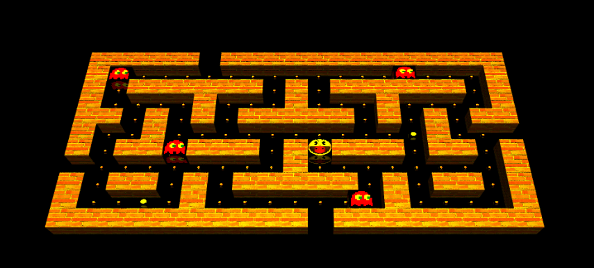

# Pacman 3D

    

PacMan game, in 3 dimensions, were all of the basic gameplay remains the same as the classic game, and also were introduced some extra features, like sounds, portals and "hard mode", were just a restricted area around PacMan is visible. 

In order to run the game, just open the index file (Pacman-3D.html) with your browser.

The game was tested in Mozilla Firefox and Microsoft Edge (Google Chrome and Safaro shouldn't work due to cross-origin images used on game textures).

If you have any more doubts, please check the report/presentation.

@Diogo Ferreira
@Pedro Martins
